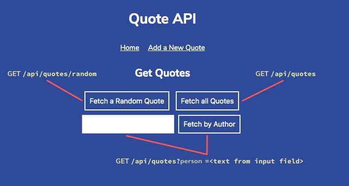

# Quote API
Express web API to store and serve different quotes about computers, coding, and technology.

TODO: 
- Add a PUT route for updating quotes in the data. This might require adding some sort of unique ID for each quote in the array in data.js.
- Add a DELETE route for deleting quotes from the data array. As with PUT, this might require adding IDs to the data array and using req.params. For both of these ideas, you’ll be able to interact via Postman.
- Add other data to the array, such as the year of each quote, and try to display it on the front-end.
- Add another resource to your API in addition to quotes, such as biographical blurbs (you’ll need to find your own data for this new resource). Use Express Routers to keep your code simple and separated into different files for each router.